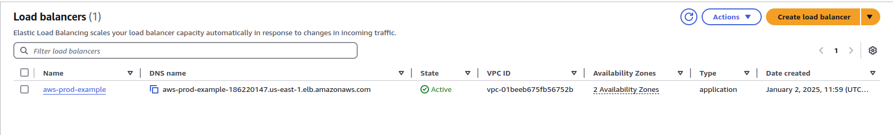

# AWS Project Used In Production | Complete Implementation

[*Project Source*](https://www.youtube.com/watch?v=FZPTL_kNvXc&list=PLdpzxOOAlwvLNOxX0RfndiYSt1Le9azze&index=9)

## Step-1: Create VPC

## Step-2: Auto Scaling group

## Step-3: Bastion host setup 

## Step-4: Load Balancer

## Step-5: Cleanup
Now clean Everything in order to prevent charges from AWS