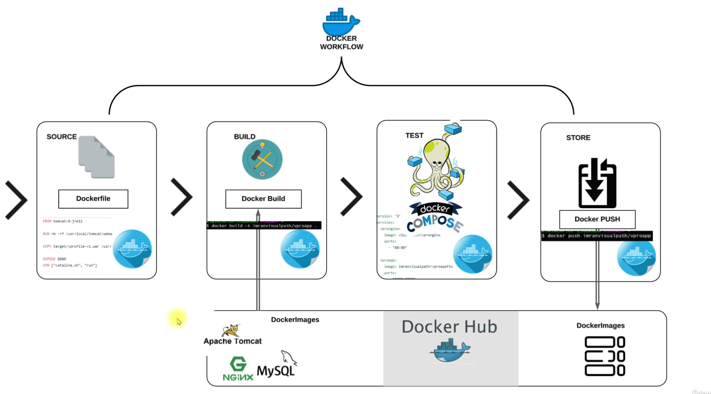

# Project 5: Docker-Based Containerization of a Java Application"

[*Project Source*](https://www.udemy.com/course/devopsprojects/?src=sac&kw=devops+projects)

## Scenario:
- we have a Multi tier Application Stack, Running on Vm's.It has regular deployment and continuous changes.

- Problem is high capex & Opex.human error in deployment.Not compatible with microservice architecture,resource wastage and Not portable & env not in syncs

- Sloution is Containers.It consume low resource and suits very well for microservice design.Deployment via images and same container images across environment and resuable and repeatbale.

### Step-1: Steps to setup our Stack services
- Setup Should be done in below mentioned order
- `MySQL (Database SVC)`        -> `8.0.33`
- `Memcache (DB Caching SVC)`   -> `1.6`
- `RabbitMQ (Broker/Queue SVC)` -> `4.0`
- `JDK`                         -> `JDK 21`
- `MAVEN`                       -> `Maven 3.9.9`
- `Tomcat (Application SVC)`    -> `10, jdk21`
- `Nginx (Web SVC)`             -> `1.27`

### Step-2: Find right Base image from dockerhub

 * mysql:8.0.33
 * memcache:latest
 * rabbitmq:latest
 * maven:3.9.9-eclipse-temurin-21-jammy
 * tomcat:10-jdk21
 * nginx:latest

### Step-3: Write Dockerfile to customize

### Step-4: Write docker-compose.yml file to run multi containers.

### Step-5:Test it & Host Images on Dockerhub