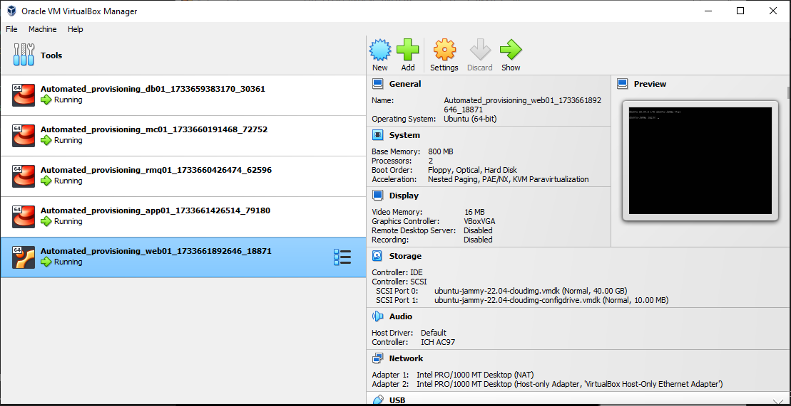
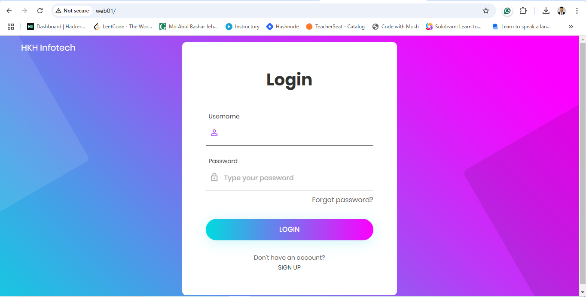
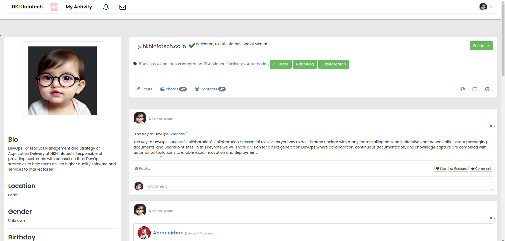
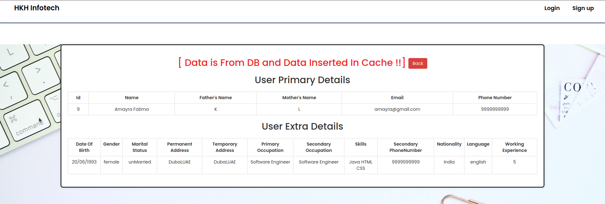
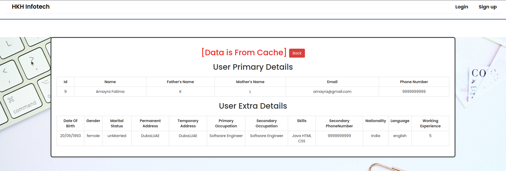
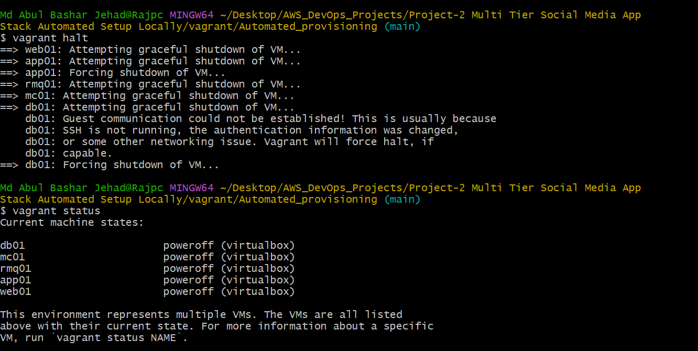
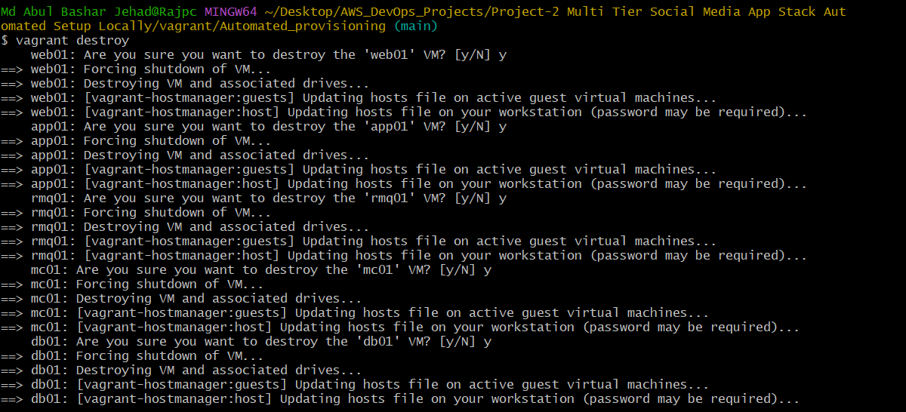

# Project-2: Project-2 Multi Tier Social Media App Stack Automated Setup Locally

[*Project Source*](https://www.udemy.com/course/devopsprojects/?src=sac&kw=devops+projects)

## Prerequisites

 * Oracle VM VirtualBox Manager
 * Vagrant
 * Vagrant plugins
 * Git
 * IDE (SublimeText, VSCode, etc)

## Step1: Preparing Bash Scripts for VMs

### Bash Script for DB

- In Project-1, we have setup our 3-Tier Social Media Application manually. This time we will create bash scripts to automate our VM creation/provisioning through Vagrantfile.

- First we will create `mysql.sh` file for our database.
```sh
#!/bin/bash
DATABASE_PASS='admin123'
sudo dnf update -y
sudo dnf install git zip unzip -y
sudo dnf install mariadb105-server -y
# starting & enabling mariadb-server
sudo systemctl start mariadb
sudo systemctl enable mariadb
cd /tmp/
git clone -b main https://github.com/hkhcoder/vprofile-project.git
#restore the dump file for the application
sudo mysqladmin -u root password "$DATABASE_PASS"
sudo mysql -u root -p"$DATABASE_PASS" -e "ALTER USER 'root'@'localhost' IDENTIFIED BY '$DATABASE_PASS'"
sudo mysql -u root -p"$DATABASE_PASS" -e "DELETE FROM mysql.user WHERE User='root' AND Host NOT IN ('localhost', '127.0.0.1', '::1')"
sudo mysql -u root -p"$DATABASE_PASS" -e "DELETE FROM mysql.user WHERE User=''"
sudo mysql -u root -p"$DATABASE_PASS" -e "DELETE FROM mysql.db WHERE Db='test' OR Db='test\_%'"
sudo mysql -u root -p"$DATABASE_PASS" -e "FLUSH PRIVILEGES"
sudo mysql -u root -p"$DATABASE_PASS" -e "create database accounts"
sudo mysql -u root -p"$DATABASE_PASS" -e "grant all privileges on accounts.* TO 'admin'@'localhost' identified by 'admin123'"
sudo mysql -u root -p"$DATABASE_PASS" -e "grant all privileges on accounts.* TO 'admin'@'%' identified by 'admin123'"
sudo mysql -u root -p"$DATABASE_PASS" accounts < /tmp/vprofile-project/src/main/resources/db_backup.sql
sudo mysql -u root -p"$DATABASE_PASS" -e "FLUSH PRIVILEGES"

```

### Bash Script for Memcached

- Next we will create a bash script to provision our memcached server.
```sh
sudo dnf install memcached -y
sudo systemctl start memcached
sudo systemctl enable memcached
sudo systemctl status memcached
sed -i 's/127.0.0.1/0.0.0.0/g' /etc/sysconfig/memcached
sudo systemctl restart memcached
sudo memcached -p 11211 -U 11111 -u memcached -d
```

### Bash Script for RabbitMQ

- This time we will create a bash script for RabbitMQ.
```sh
#!/bin/bash
## primary RabbitMQ signing key
rpm --import 'https://github.com/rabbitmq/signing-keys/releases/download/3.0/rabbitmq-release-signing-key.asc'
## modern Erlang repository
rpm --import 'https://github.com/rabbitmq/signing-keys/releases/download/3.0/cloudsmith.rabbitmq-erlang.E495BB49CC4BBE5B.key'
## RabbitMQ server repository
rpm --import 'https://github.com/rabbitmq/signing-keys/releases/download/3.0/cloudsmith.rabbitmq-server.9F4587F226208342.key'
curl -o /etc/yum.repos.d/rabbitmq.repo https://raw.githubusercontent.com/hkhcoder/vprofile-project/refs/heads/awsliftandshift/al2023rmq.repo
dnf update -y
## install these dependencies from standard OS repositories
dnf install socat logrotate -y
## install RabbitMQ and zero dependency Erlang
dnf install -y erlang rabbitmq-server
systemctl enable rabbitmq-server
systemctl start rabbitmq-server
sudo sh -c 'echo "[{rabbit, [{loopback_users, []}]}]." > /etc/rabbitmq/rabbitmq.config'
sudo rabbitmqctl add_user test test
sudo rabbitmqctl set_user_tags test administrator
rabbitmqctl set_permissions -p / test ".*" ".*" ".*"

sudo systemctl restart rabbitmq-server
```

### Bash Script for Application

- We will create a Bash script to provision Tomcat server for our application.
```sh
#!/bin/bash
sudo apt update
sudo apt upgrade -y
sudo apt install openjdk-17-jdk -y
sudo apt install tomcat10 tomcat10-admin tomcat10-docs tomcat10-common git -y
```

### Bash Script for Nginx server

- Lastly we will create a bash script to provision Nginx server which will forward requests to our backend application.
```sh
# adding repository and installing nginx		
apt update
apt install nginx -y
cat <<EOT > vproapp
upstream vproapp {

 server app01:8080;

}

server {

  listen 80;

location / {

  proxy_pass http://vproapp;

}

}

EOT

mv vproapp /etc/nginx/sites-available/vproapp
rm -rf /etc/nginx/sites-enabled/default
ln -s /etc/nginx/sites-available/vproapp /etc/nginx/sites-enabled/vproapp

#starting nginx service and firewall
systemctl start nginx
systemctl enable nginx
systemctl restart nginx
```

## Step2: Preparing Bash Scripts for VMs

- First clone the repository
```sh
git clone https://github.com/hkhcoder/vprofile-project.git
```

- We need to go to directory that our Vagrantfile exists. Before we run our VBoxes using `vagrant`, we need to install below plugin.
```sh
vagrant plugin install vagrant-hostmanager
```

- After plugin installed, we can run below command to setup our VMs which will also bootstrap our servers for us.
```sh
vagrant up
```

- Our VMs are ready in VirtualBox.

## Step3: Validate Application from Browser

- We can validate the application using hostname given in Vagrantfile. Go to browser `http://web01`. Frontend is working successfully.


- Backend services also up/running. 


- We can validate RabbitMq service.


- Next we can check our DB/Memcache services.



- If we want to stop our VMs, we can use below command:
```sh
vagrant halt
```

- We can check status of our VMs with below command:
```sh
vagrant status
```

- If we want to start again, we can easily run:
```sh
vagrant up 
```

- Once we are done, we can destroy our VMs:
```sh
vagrant destroy
```

