# Project-3 Migrating and Managing Application Workflows on AWS

[*Project Source*](https://www.udemy.com/course/devopsprojects/?src=sac&kw=devops+projects)

## Prerequisites:
 * AWS Account
 * Registered Domain
 * Maven
 * JDK8
 * AWS CLI

##### Architecture on DataCenter:
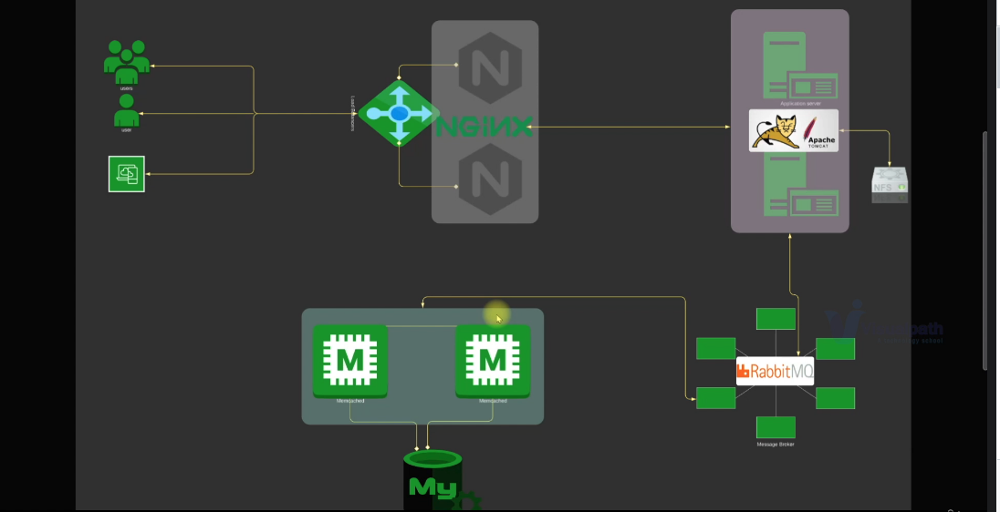

##### Architecture on AWS:


### Step-1: Create Security Groups for Services

- We will create `vprofile-ELB-SG` first. We will configure `Inbound` rules to Allow both `HTTP` and `HTTPS` on port `80` and `443` respectively  from Anywhere `IPv4` and `IPv6`.
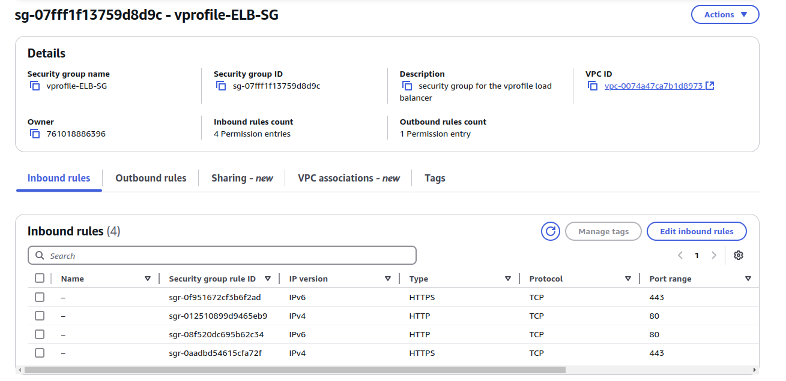

- Next we will create `vprofile-app-SG`. We will open port `8080` to accept connections from `vprofile-ELb-SG`.
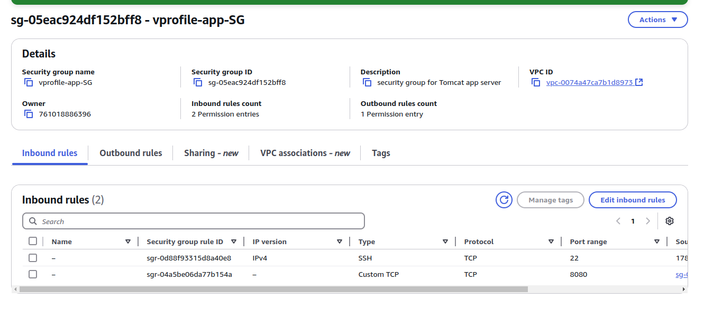

- Finally, we will create `vprofile-backend-SG`. WE need to open port `3306` for `MySQL`, `11211` for `Memcached` and `5672` for `RabbitMQ` server. We can check whcih ports needed fro aplication services to communicate each other from `application.properties` file under `src/main/resources` directory.We also need to open commucation `AllTraffic` from own SecGrp for backend services to communicate with each other.
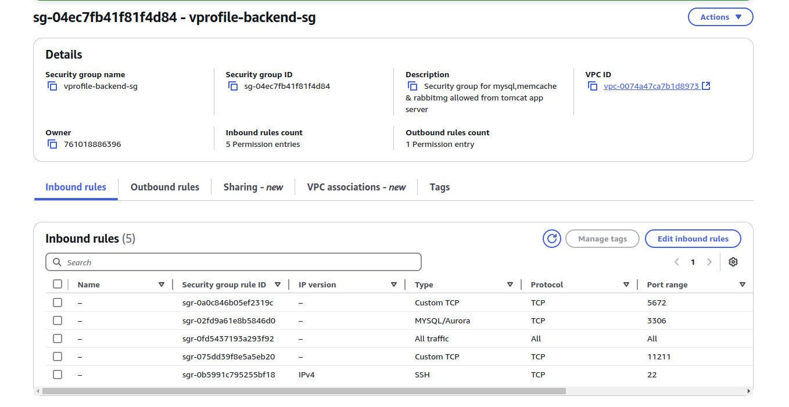

### Step-2: Create KeyPair to Connect EC2 instances

- We will create a Keypair to connect our instances via SSH.
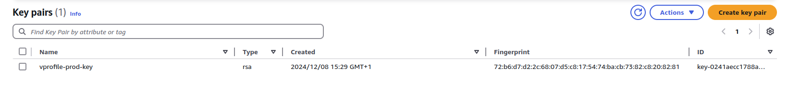


### Step-3: Provision Backend EC2 instances with UserData script

##### DB Instance:

- Create DB instance with below details.We will also add Inbound rule to `vprofile-backend-SG` for `SSH` on port `22`  from `MyIP` to be able to connect our db instance via SSH.
```sh
Name: vprofile-db01
Project: vprofile
AMI: Amazon Linux 2023 AMI 
InstanceType: t2.micro
SecGrp: vprofile-backend-SG
UserData: mysql.sh
```
- Once our instance is ready, we can SSH into the server and check if userdata script is executed.We can also check status of mariadb.
```sh
ssh -i "vprofile-prod-key.pem" ec2-user@<public_ip_of_instance>
systemctl status mariadb
```
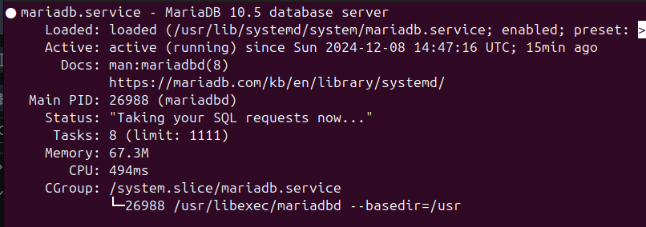

##### Memcached Instance:

- Create Memcached instance with below details.
```sh
Name: vprofile-mc01
Project: vprofile
AMI: Amazon Linux 2023 AMI
InstanceType: t2.micro
SecGrp: vprofile-backend-SG
UserData: memcache.sh
```
- Once our instance is ready, we can SSH into the server and check if userdata script is executed.We can also check status of memcache service and if it is listening on port 11211.
```sh
ssh -i "vprofile-prod-key.pem" ec2-user@<public_ip_of_instance>
sudo su -
systemctl status memcached
```
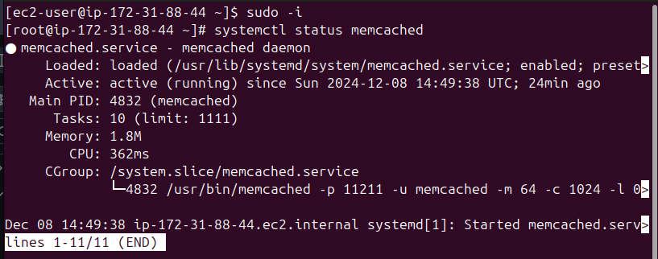

##### RabbitMQ Instance:

- Create RabbitMQ instance with below details.
```sh
Name: vprofile-rmq01
Project: vprofile
AMI: Amazon Linux 2023 AMI
InstanceType: t2.micro
SecGrp: vprofile-backend-SG
UserData: rabbitmq.sh
```
- Once our instance is ready, we can SSH into the server and check if userdata script is executed.We can also check status of rabbitmq service.
```sh
ssh -i "vprofile-prod-key.pem" ec2-user@<public_ip_of_instance>
sudo su -
systemctl status rabbitmq-server
```
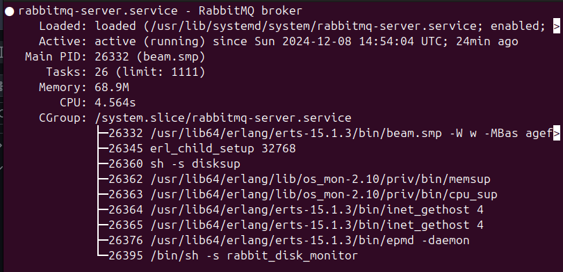

### Step-3: Create Private Hosted Zone in Route53 

- Our backend stack is running. Next we will update Private IP of our backend services in Route53 Private DNS Zone.Lets note down Private IP addresses.
```sh
rmq01 172.31.85.251
db01 172.31.84.208
mc01 172.31.88.44
```
- Create `vprofile.in` Private Hosted zone in Route53. we will pick `Default VPC` in `N.Virginia` region.

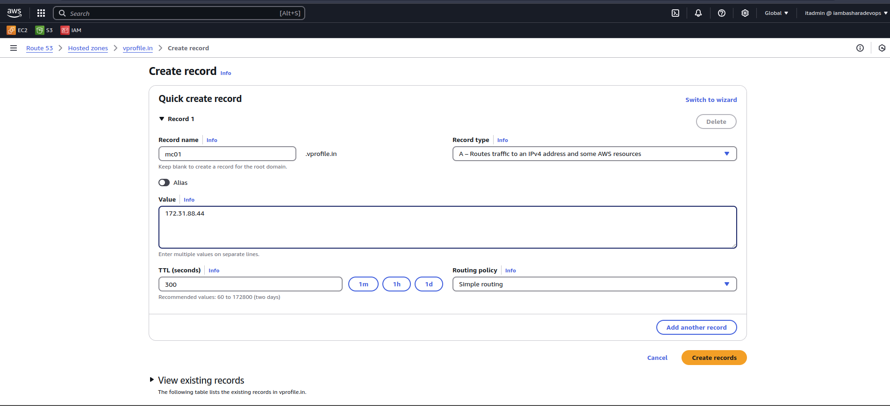

- Now we will create records for our backend services. The purpose of this activity is we will use these record names in our `application.properties` file. Even if IP address of the services, our application won't need to change the config file.  
```sh
Simple Routing -> Define Simple Record
Value/Route traffic to: IP address or another value
```
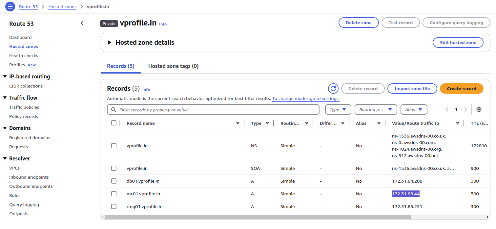

### Step-4: Provision Application EC2 instances with UserData script

- Create Tomcat instance with below details.We will also add Inbound rule to `vprofile-app-SG` for `SSH` on port `22`  from `MyIP` to be able to connect our db instance via SSH.
```sh
Name: vprofile-app01
Project: vprofile
AMI: Ubuntu 24.04
InstanceType: t2.micro
SecGrp: vprofile-app-SG
UserData: tomcat_ubuntu.sh
```

### Step-5: Create Artifact Locally with MAVEN

- Clone the repository.
```sh
git clone https://github.com/hkhcoder/vprofile-project.git
- make sure choose awsliftandshift branch
```

- Before we create our artifact, we need to do changes to our `application.properties` file under `/src/main/resources` directory for below lines.
```sh
jdbc.url=jdbc:mysql://db01.vprofile.in:3306/accounts?useUnicode=true&

memcached.active.host=mc01.vprofile.in

rabbitmq.address=rmq01.vprofile.in
```
- We will go to `vprofile-project` root directory to the same level pom.xml exists. Then we will execute below command to create our artifact `vprofile-v2.war`:

```sh
mvn install
```
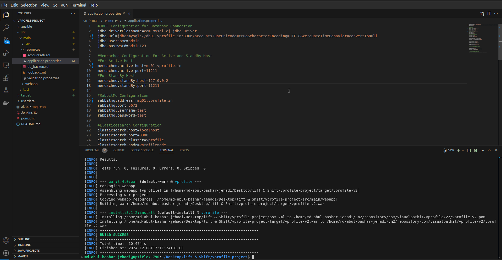

### Step-6: Create S3 bucket

- We will create an IAM user for authentication to be used from AWS CLI.
```sh
name: vprofile-s3-admin
Access key - Programmatic access
Policy: s3FullAccess
```
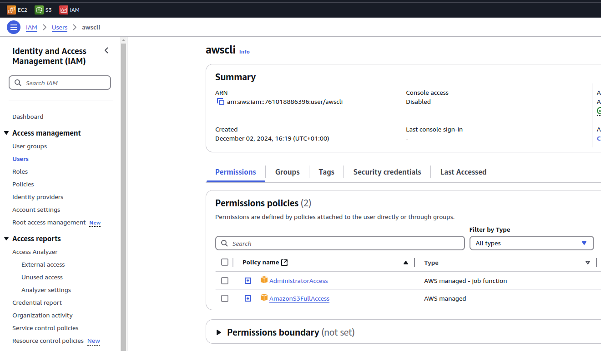

- Next we will configure our `aws cli` to use iam user credentials.
```sh
aws configure
AccessKeyID: 
SecretAccessKey:
region: us-east-1
format: json
```
- Create bucket. Note: S3 buckets are global so the naming must be UNIQUE!
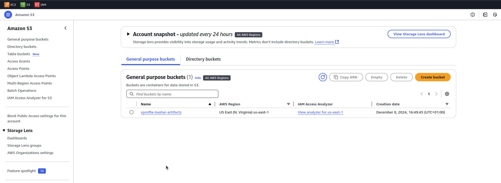

- We will upload our artifact to s3 bucket from AWS CLI and our Tomcat server will get the same artifact from s3 bucket.

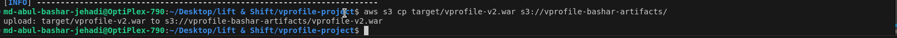

- We can verify the from AWS Console.
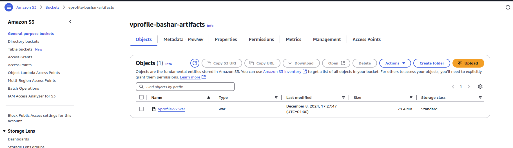

### Step-7: Download Artifact to Tomcat server from S3

- In order to download our artifact onto Tomcat server, we need to create IAM role for Tomcat. Once role is created we will attach it to our `app01` server.
```sh
Type: EC2
Name: vprofile-artifact-storage-role
Policy: s3FullAccess
```
- Before we login to our server, we need to add SSH access on port 22 to our `vprofile-app-SG`.

- Then connect to `app011` Ubuntu server.
```sh
ssh -i "vprofile-prod-key.pem" ubuntu@<public_ip_of_server>
sudo su -
systemctl status tomcat10
```

- We will delete `ROOT` (where default tomcat app files stored) directory under `/var/lib/tomcat10/webapps/`. Before deleting it we need to stop Tomcat server. 
```sh
cd /var/lib/tomcat10/webapps/
systemctl stop tomcat10
rm -rf ROOT
```
- Next we will download our artifact from s3 using aws cli commands. First we need to install `aws cli`. We will initially download our artifact to `/tmp` directory, then we will copy it under `/var/lib/tomcat10/webapps/` directory as `ROOT.war`. Since this is the default app directory, Tomcat will extract the compressed file.
```sh
snap install aws-cli --classic
aws s3 ls s3://vprofile-bashar-artifacts
aws s3 cp s3://vprofile-bashar-artifacts/vprofile-v2.war /tmp/
cp vprofile-v2.war /var/lib/tomcat10/webapps/ROOT.war
systemctl start tomcat10
```
### Step-8: Setup LoadBalancer

- Before creating LoadBalancer , first we need to create Target Group.
```sh
Intances
Target Grp Name: vprofile-bashar-TG
protocol-port: HTTP:8080
healtcheck path : /login
Advanced health check settings
Override: 8080
Healthy threshold: 3
available instance: app01 (Include as pending below)
```

- Now we will create our Load Balancer.
```sh
vprofile-bashar-elb
Internet Facing
Select all AZs
SecGrp: vprofile-elb-secGrp
Listeners: HTTP, HTTPS
Select the certificate for HTTPS
```

### Step-9: Create Route53 record for ELB endpoint

- We will copy our load balancers dns name and add into godaady dns record so that we can acees our website through our domain 

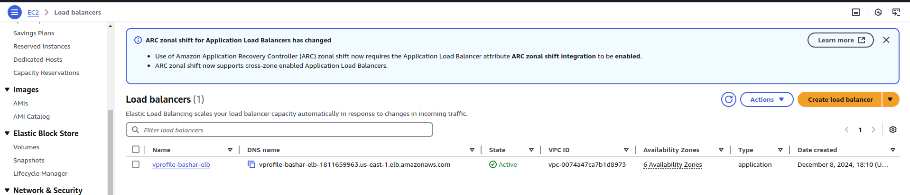

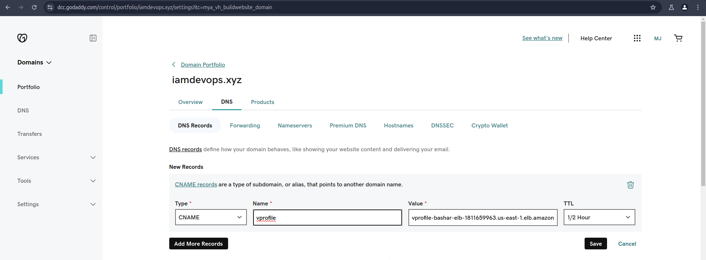

- Lets check our application using our DNS. We can securely connect to our application!

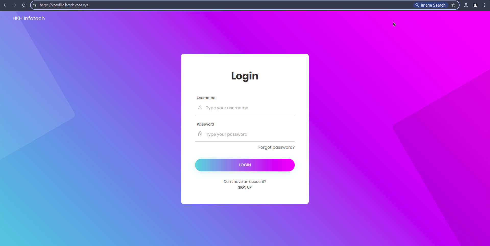  

### Step-10: Configure AutoScaling Group for Application Instances

- We will create an AMI from our App Instance.

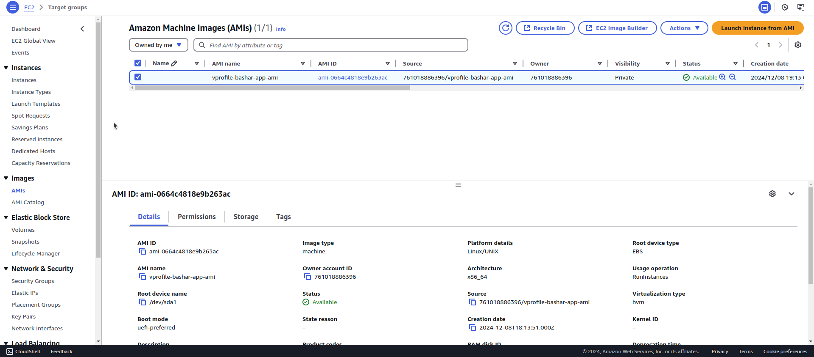

- Next we will create a Launch template using the AMI created in above step for our ASG.
```sh
Name: vprofile-bashar-app-LT
AMI: vprofile-app-image
InstanceType: t2.micro
IAM Profile: vprofile-artifact-storage-role
SecGrp: vprofile-app-SG
KeyPair: vprofile-prod-key
```

- Our Launch template is ready, now we can create our ASG.
```sh
Name: vprofile-bashar-app-asg
ELB healthcheck
Add ELB
Min:1
Desired:2
Max:4
Target Tracking-CPU Utilization 50
```
- If we terminate any instances we will see ASG will create a new one using LT that we created.

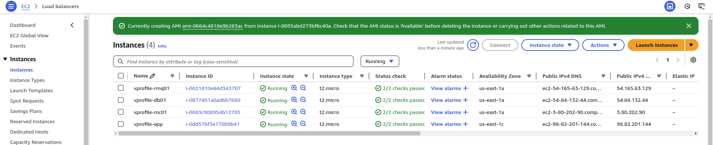

### Step-11: Clean-up

- Delete all resources we created to avoid any charges from AWS.
