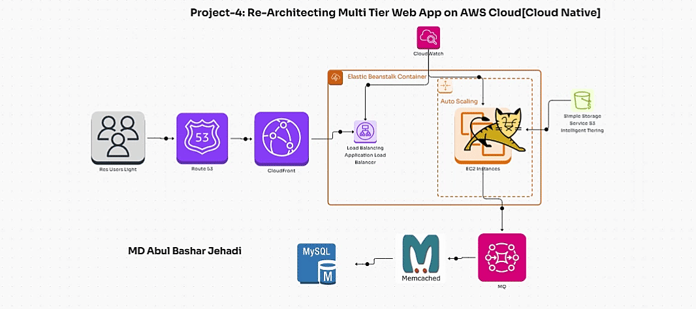
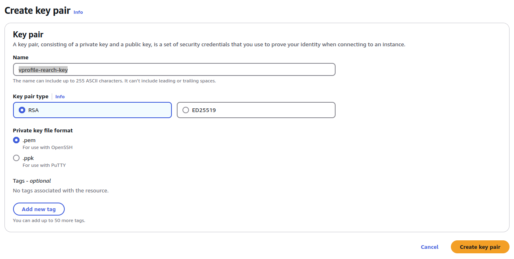
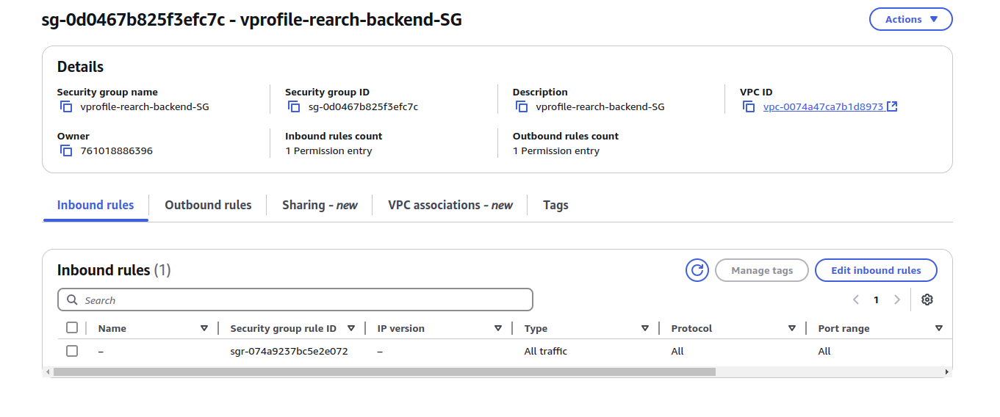
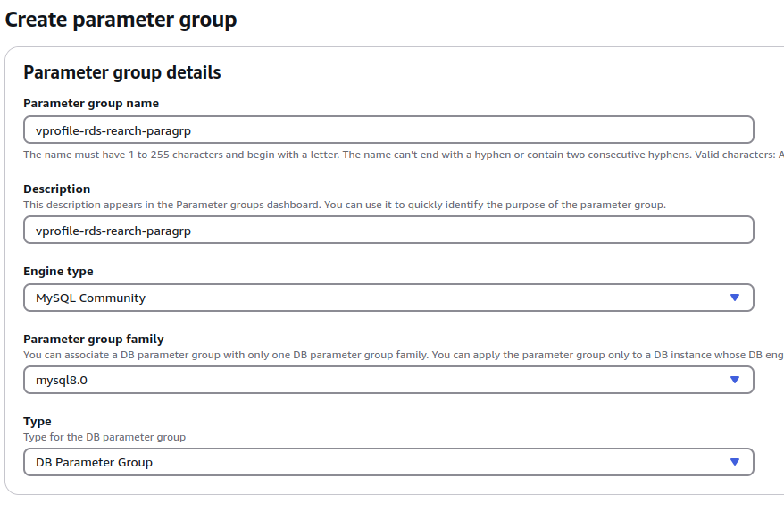
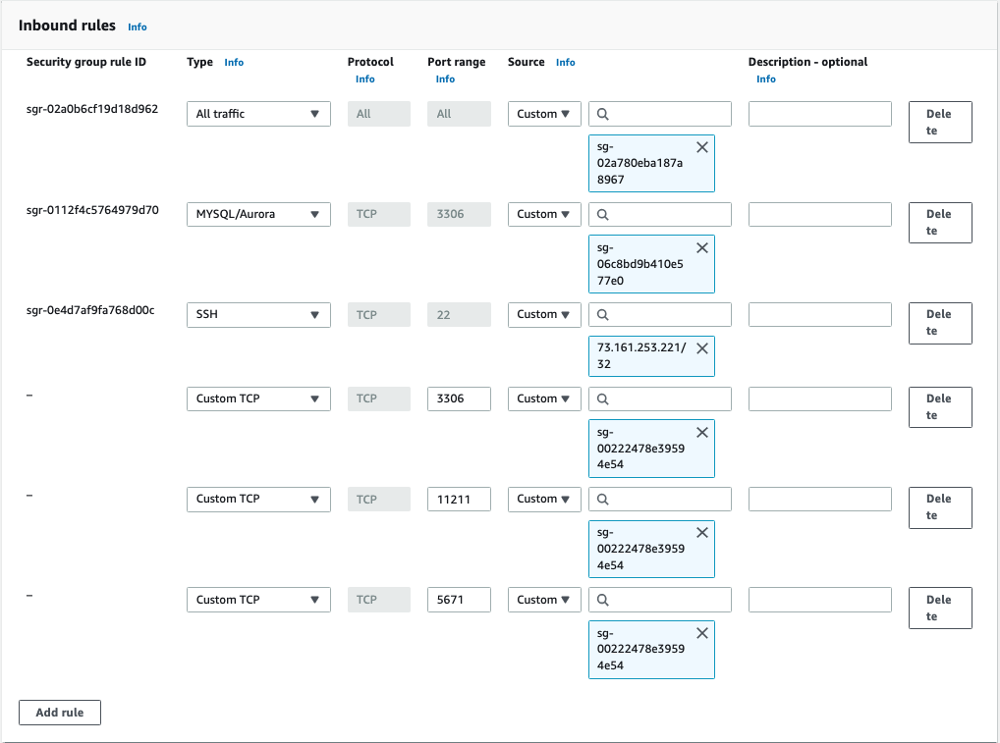
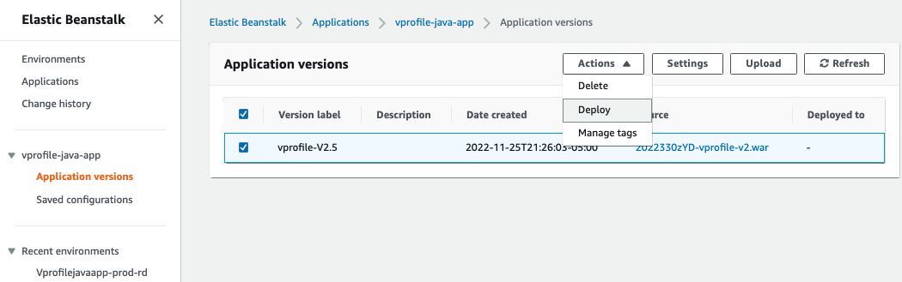
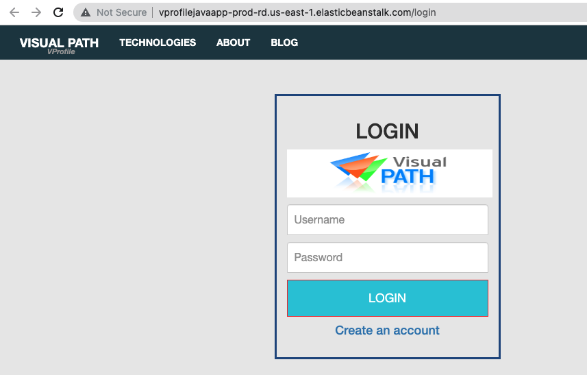

# Project-4: Re-Architecting Multi Tier Web App on AWS Cloud[Cloud Native]


[*Project Source*](https://www.udemy.com/course/devopsprojects/?src=sac&kw=devops+projects)

# About The Project:
  * Multi tier web app stack (Vprofile) Re-Architect Services for AWS Cloud
  * Architecture to boost agility or improve business continuity

## Scenario:
- project services running on physical/virtual/Cloud machines like EC2 instances and dealing with various services for the application workload.To manage this it requires multiple teams like cloud computing teams,virtualization team,DC ops team,Monitoring team,Sys Admins etc.

- Problem is too much operational overhead,team is struugling with Uptime & Scaling and there is upfront capex & Regular opex.

- Process is manual and difficult to automate 

- sloution can be cloud platform but insted of using it can be sloved through IAS like PAAS & SAAS

## Objective:
-  Fleible infra,no upcoming cost,IAAC,PAAS,SAAS
## Pre-requisites:
  * AWS Account
  * Default VPC
  * Route53 Public Registered Name
  * Maven
  * JDK8



### Step-1: Create Keypair for Beanstalk EC2 Login

- We will create a key pair to be used with Elastic Beanstalk. Go to `EC2` console, on left menu select `KeyPair` -> `Create key pair`.
```sh
vprofile-rearch-key
```
- Remember where to download the private key, it will be used when logging in to EC2 via SSH.


### Step-2: Create Security Group for ElastiCache, RDS and ActiveMQ

- Create a Security Group with name `vprofile-rearch-backend-SG`. Once it is created we need to edit `Inbound` rules: we will choose vprofile-rearch-backend-SG  as source thats first create the security group and later add inbound rule.
```sh
All Traffic from `vprofile-rearch-backend-SG`
```  

### Step-3: Create RDS Database

#### Create Subnet Group:

- First we will create `Subnet Groups` with below properties:
```sh
Name: vprofile-rds-rearch-subgrp
AZ: Select All
Subnet: Select All
```

#### Create Parameter Group

- We will create a parameter group to be used with our RDS instance. If we want to use default parameter group we don't need to create one. With parameter group, we are able make updates to default parameter for our RDS instance.

```sh
Parameter group family: mysql8.0
Type: DB Parameter Group
Group Name: vprofile-rds-rearch-paragrp
```

#### Create Database

- We will create RDS instance with below properties:
```sh
Method: Standard Create
Engine Options: MySQL
Engine version: MySQL 8.0.39
Templates: Free-Tier
DB Instance Identifier: vprofile-rds-rearch
Master username: admin
Password: Auto generate psw
Instance Type: db.t4g.micro
Subnet grp: vprofile-rds-rearch-subgrp
SecGrp:  vprofile-rearch-backend-SG
No public access
DB Authentication: Password authentication
Additional Configuration
Initial DB Name: accounts
Keep the rest default or you may add as your own preference
```

- After clicking `Create` button, you will see a popup. Click `View credential details` and note down auto-generated db password. We will use it in our application config files.

### Step-3: Create ElastiCache


#### Create Parameter Group

- We will create a parameter group to be used with our ElastiCache instance. If we want to use default parameter group we don't need to create one. With parameter group, we are able make updates to default parameters for our ElasticCache instance.

```sh
Name: vprofile-rearch-cache-paragrp
Description: vprofile-rearch-cache-paragrp
Family: memcached1.6
```

#### Create Subnet Group:

- First we will create `Subnet Groups` with below properties:
```sh
Name: vprofile-reach-cache-subgrp
AZ: Select All
Subnet: Select All
```

#### Create Memcached Cluster

- Go to `Get Started` -> `Create Clusters` -> `Memcached Clusters`
```sh
Choose a cluster creation method: Design your own cache & Standard create
Location: AWS Cloud
Name: vprofile-rearch-cache
Engine version: 1.6.22
Port:11211
Parameter Grp: vprofile-rearch-cache-paragrp
NodeType: cache.t2.micro
# of Nodes: 1
SecGrp: vprofile-reach-cache-subgrp
```

### Step-4: Create Amazon MQ

- We will create Amazon MQ service with below properties:
```sh
Engine type: RabbitMQ
Single-instance-broker
Broker name: vprofile-rearch-rabbitmq
Instance type: mq.t3.micro
username: rabbit
psw: BlueBunny9890
Additional Settings:
Broker engine:3.13
private Access
VPC: use default
SEcGrp: vprofile-rearch-backend-SG
```

- Do not forget to note down your username/pwd. You won't be able to see your Password again from console.

### Step-5: DB Initialization

- Go to RDS instance copy endpoint.
```sh
vprofile-red-rearch.cryw2acg603h.us-east-1.rds.amazonaws.com
```

- Create an EC2 instance to initialize the DB, this instance will be terminated after initialization.
```sh
Name: mysql-client
OS: Ubuntu Server 24.04 LTS
t2.micro
SecGrp: Allow SSH on port 22
Keypair: vprofile-rearch-key

- SSH into `mysl-client` instance. We can check mysql version
```sh
sudo -i
apt update && apt install mysql-client git -y
mysql -V
```

- Before we login to database, we need to update `vprofile-backend-SG` Inbound rule to allow connection on port 3306 for `mysql-client-SG`
After updating rule, try to connect with below command:
```sh
mysql -h vprofile-red-rearch.cryw2acg603h.us-east-1.rds.amazonaws.com -u admin -p<db_password>
mysql> show databases;
```

- Next we will clone our source code here to use script to initialize our database. After these commands we should be able to see 2 tables `role`, `user`, and `user_role`.

```sh
git clone https://github.com/hkhcoder/vprofile-project.git
cd vprofile-project
git checkout awsrefactor
cd src/main/resources
mysql -h vprofile-red-rearch.cryw2acg603h.us-east-1.rds.amazonaws.com -u admin -pWw2KX6oqe4ybRYfT0GJn accounts < src/main/resources/db_backup.sql
mysql -h vprofile-red-rearch.cryw2acg603h.us-east-1.rds.amazonaws.com -u admin -pWw2KX6oqe4ybRYfT0GJn accounts
show tables;
```

### Step-5: Create Elastic Beanstalk Environment

- Our backend services are ready now. We will copy their endpoints from AWS console. These information will be used in our `application.properties` file
```sh
RDS:
profile-red-rearch.cryw2acg603h.us-east-1.rds.amazonaws.com
ActiveMQ: b-137560a2-38a7-4f5f-b6b8-e63c0a2e011a.mq.us-east-1.amazonaws.com:5671
ElastiCache:
vprofile-rearch-cache.mr7zqj.cfg.use1.cache.amazonaws.com:11211
```

#### Create Application

- Application in Elastic Beanstalk means like a big container which can have multiple environments. Since out app is Running on Tomcat we will choose `Tomcat` as platform.
```sh
Name: vprofile-rearch-beanapp
Platform: Tomcat
keep the rest default
Configure more options:
- Custom configuration
****Instances****
EC2 SecGrp: vprofile-backend-SG
****Capacity****
LoadBalanced
Min:2
Max:4
InstanceType: t2.micro
****Rolling updates and deployments****
Deployment policy: Rolling
Percentage :50 %
****Security****
EC2 key pair: vprofile-bean-key
```

### Step-5: Update Backend SecGrp & ELB

- Our application instances created by BeanStalk will communicate with Backend services. We need update `vprofile-backend-SG` to allow connection from our appSecGrp created by Beanstalk on port `3306`, `11211` and `5671` 
```sh
Custom TCP 3306 from Beanstalk SecGrp(you can find id from EC2 insatnces)
Custom TCP 11211 from Beanstalk SecGrp
Custom TCP 5671 from Beanstalk SecGrp
```


- In Elastic Beanstalk console, under our app environment, we need to clink Configuration and do below changes and apply:
```sh
Add Listener HTTPS port 443 with SSL cert
Processes: Health check path : /login
```

### Step-6: Build and Deploy Artifact

- Go to directory that we cloned project, we need to checkout aws-refactor branch. Update below fields in `application.properties` file with correct endpoints and username/pwd.
```sh
vim src/main/resources/application.properties
*****Updates*****
jdbc.url
jdbc.password
memcached.active.host
rabbitmq.address
rabbitmq.username
rabbitmq.password
```

- Go to root directory of project to the same level with `pom.xml` file. Run below command to build the artifact.
```sh
mvn install
``` 

#### Upload Artifact to Elastic Beanstalk

- Go to Application versions and Upload the artifact from your local. It will autmatically upload the artifact to the S3 bucket created by Elasticbeanstalk.

- Now we will select our uploaded application and click Deploy.



- Let's check if our application deployed successfully.




### Step-7: Create DNS Record in Route53 for Application

- We will create an A record which aliasing Elastic Beanstalk endpoint.

- Now we can reach our application securely with DNS name we have given.


### Step-8: Create Cloudfront Distribution for CDN

- Cloudfront is Content Delivery Nettwork service of AWS. It uses Edge Locations around the world to deliver contents globally with best performance. We will to `CloudFront` and create a distribution.
```sh
Origin Domain: DNS record name we created for our app in previous step
Viewer protocol: Redirect HTTP to HTTPS
Alternate domain name: DNS record name we created for our app in previous step
SSL Certificate: 
Security policy: TLSv1
``` 
- Now we can check our application from browser.


### Step-9: Clean-up

- We will delete all resources that we have created throughout the project.