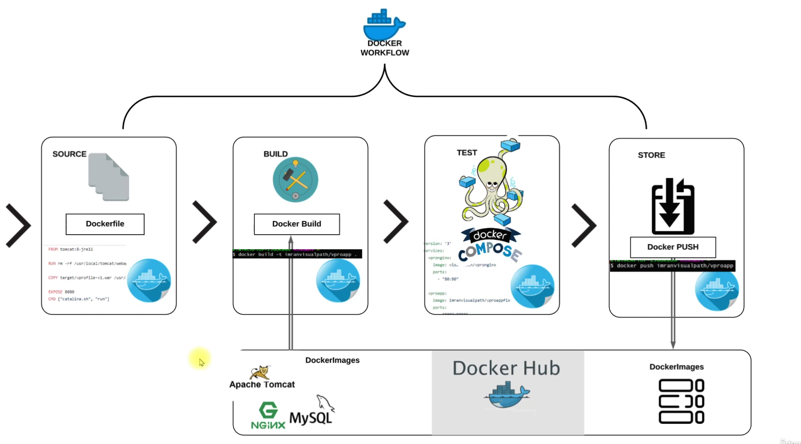

# Project 5: Docker-Based Containerization of a Java Application"


[*Project Source*](https://www.udemy.com/course/devopsprojects/?src=sac&kw=devops+projects)

## Scenario:
- we have a Multi tier Application Stack, Running on Vm's.It has regular deployment and continuous changes.

- Problem is high capex & Opex.human error in deployment.Not compatible with microservice architecture,resource wastage and Not portable & env not in syncs

- Sloution is Containers.It consume low resource and suits very well for microservice design.Deployment via images and same container images across environment and resuable and repeatbale.




### Step-1: Steps to setup our Stack services
- Setup Should be done in below mentioned order
- `MySQL (Database SVC)`        -> `8.0.33`
- `Memcache (DB Caching SVC)`   -> `1.6`
- `RabbitMQ (Broker/Queue SVC)` -> `4.0`
- `JDK`                         -> `JDK 21`
- `MAVEN`                       -> `Maven 3.9.9`
- `Tomcat (Application SVC)`    -> `10, jdk21`
- `Nginx (Web SVC)`             -> `1.27`


### Step-2: Find right Base image from dockerhub

 * mysql:8.0.33
 * memcache:latest
 * rabbitmq:latest
 * maven:3.9.9-eclipse-temurin-21-jammy
 * tomcat:10-jdk21
 * nginx:latest


### Step-3: Write Dockerfile to customize

- We will clone  below repository and make sure choose container branch .
```sh
git clone https://github.com/hkhcoder/vprofile-project.git
```
- After cloning we can open the project in vs code and we will see in projects structure a folder called Docker-files and here app,db & web folder exist and each folder has  an empty Dockerfile where we are going to write our docker commands.

### Dockerfile for app
```sh
FROM maven:3.9.9-eclipse-temurin-21-jammy AS BUILD_IMAGE
RUN git clone https://github.com/hkhcoder/vprofile-project.git
RUN cd vprofile-projects && git checkout containers && mvn install

FROM tomcat:10-jdk21
RUN rm -rf /usr/local/tomcat/webapps/*
COPY --from=BUILD_IMAGE vprofile-project/target/vprofile-v2.war /usr/local/tomcat/webapps/ROOT.war

EXPOSE 8080
CMD [ "catalina.sh","run" ]
```

### Dockerfile for db
```sh
FROM mysql:8.0.33
LABEL Project="Vprofile"
LABEL Authror="Bashar"

ENV MYSQL_ROOT_PASSWORD="vprodbpass"
ENV MYSQL_DATABASE="accounts"

ADD db_backup.sql docker-entrypoint-initdb.d/db_backup.sql
```

### Dockerfile for web
```sh
FROM nginx 
LABEL Project="Vprofile"
LABEL Authror="Bashar"

RUN rm -rf /etc/nginx/conf.d/default.conf
COPY nginvproapp.conf /etc/nginx/conf.d/vproapp.conf
```
 - For other two services (Memcached & rabbitMq) we don't need seperate dockerfile we can just use official images.

### Step-4: Write docker-compose.yml file to run multi containers.
- Below our docker-compose file
```sh
version: '3.8'
services:
  vprodb:
    build: 
     context: ./Docker-files/db
    image: basharjehadi/vprofiledb
    container_name: vprodb
    ports:
      - "3306:3306"
    volumes:
      - vprodbdata:/var/lib/mysql
    environment:
      - MYSQL_ROOT_PASSWORD=vprodbpass
  vprocache01:
    image: memcached
    container_name: vprocache01
    ports:
      - "11211:11211"

  vpromq01:
    image: rabbitmq
    container_name: vpromq01
    ports:
      - "5672:5672"
    environment:
      - RABBITMQ_DEFAULT_USER=guest
      - RABBITMQ_DEFAULT_PASS=guest    

  vproapp:
    build: 
     context: ./Docker-files/app
    image: basharjehadi/vprofileapp
    container_name: vproapp
    ports:
      - "8081:8080"
    volumes:
      - vproappdata:/usr/local/tomcat/webapps
  
  vproweb:
    build: 
     context: ./Docker-files/web
    image: basharjehadi/vprofileweb
    container_name: vproweb
    ports:
      - "80:80"


volumes:
  vprodbdata: {}
  vproappdata: {}
  

```

### Step-5:Test it & Host Images on Dockerhub
- As we can see our app is running on port 8081


- we push our three docker images into dockerhub

