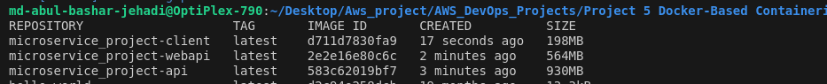
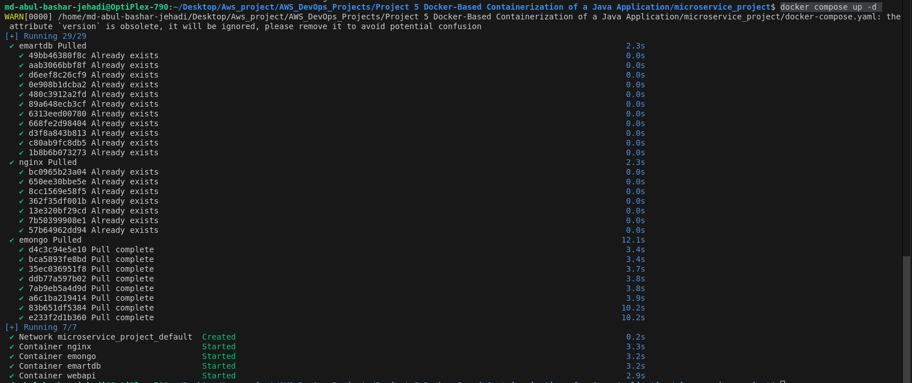
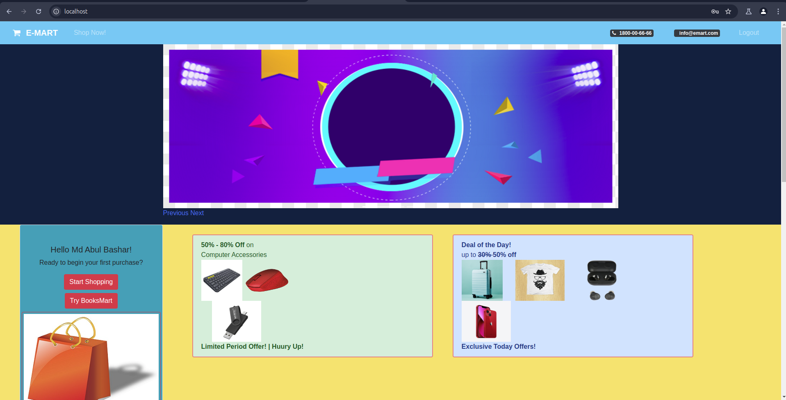

# Project : Microsservice Project emart-app


[*Project Source*](https://www.udemy.com/course/devopsprojects/?src=sac&kw=devops+projects)

## Prerequisites
* Docker
* Docker compose 
## Description:
- In this Ecommerce(Emart) microservice project we have 4 services (Angular,Nodejs,java & nginx)


## Clone the project from Github
```sh
git clone https://github.com/devopshydclub/emartapp.git
```
- all the microservices source code in this repo client(Angular application), javaapi(books api),nginx(api gateway),nodeapi(nodejs microservice)
- all the source code in one repository this  kind of repo call monorepo
## Client(Angular application) has a Dockerfile
```sh
FROM node:14 AS web-build
WORKDIR /usr/src/app
COPY ./ ./client
RUN cd client && npm install && npm run build --prod

# Use official nginx image as the base image
FROM nginx:latest

# Copy the build output to replace the default nginx contents.
COPY --from=web-build /usr/src/app/client/dist/client/ /usr/share/nginx/html
COPY nginx.conf /etc/nginx/conf.d/default.conf

# Expose port 4200
EXPOSE 4200

```

## Nodeapi(nodejs microservice) has a Dockerfile
```sh
FROM node:14 AS nodeapi-build
WORKDIR /usr/src/app
COPY ./ ./nodeapi/
RUN cd nodeapi && npm install

FROM node:14
WORKDIR /usr/src/app/
COPY --from=nodeapi-build /usr/src/app/nodeapi/ ./
RUN ls
EXPOSE 5000
CMD ["/bin/sh", "-c", "cd /usr/src/app/ && npm start"]
# Test3


```

## Javaapi(books api) has a Dockerfile
```sh
FROM openjdk:8 AS BUILD_IMAGE
WORKDIR /usr/src/app/
RUN apt update && apt install maven -y
COPY ./ /usr/src/app/
RUN mvn install -DskipTests

FROM openjdk:8

WORKDIR /usr/src/app/
COPY --from=BUILD_IMAGE /usr/src/app/target/book-work-0.0.1-SNAPSHOT.jar ./book-work-0.0.1.jar

EXPOSE 9000
ENTRYPOINT ["java","-jar","book-work-0.0.1.jar"]
# Test


```

## Finally we have a docker-compose.yml file
```sh
version: "3.8"

services:
  client:
    build:
      context: ./client
    ports:
      - "4200:4200"
    container_name: client
    depends_on:
      - api
      - webapi

  api:
    build:
      context: ./nodeapi
    ports:
      - "5000:5000"
    restart: always
    container_name: api
    depends_on:
      - nginx
      - emongo

  webapi:
    build:
      context: ./javaapi
    ports:
      - "9000:9000"
    restart: always
    container_name: webapi
    depends_on:
      - emartdb

  nginx:
    restart: always
    image: nginx:latest
    container_name: nginx
    volumes:
      - "./nginx/default.conf:/etc/nginx/conf.d/default.conf"
    ports:
      - "80:80"

  emongo:
    image: mongo:4
    container_name: emongo
    environment:
      - MONGO_INITDB_DATABASE=epoc
    ports:
      - "27017:27017"

  emartdb:
    image: mysql:8.0.33
    container_name: emartdb
    ports:
      - "3306:3306"
    environment:
      - MYSQL_ROOT_PASSWORD=emartdbpass
      - MYSQL_DATABASE=books


```

## Let's Build the Docker images 
- make sure we are in right directory where docker-compose.yml exist
- let's run the command
```sh
docker compose build
```
- it should create below docker images images



## Let's run the containers

```sh
docker compose up -d
```
- output should be like below



## Access the Microservice Emart app
- we have docker locally and the nginx port selected 80:80 so we can access our site by localhost in browser.
```sh
localhost
```


## Cleanup 
- once we are down we can start cleanup first command is 
```sh
docker compose down
```
- we can use below command for deleting docker images earlier we created.
```sh
docker image prune --all
```