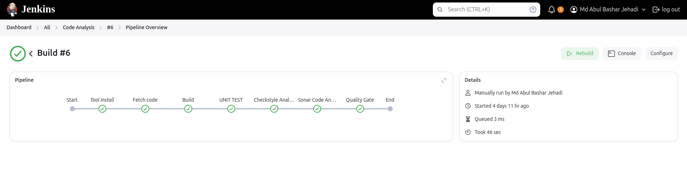

# Project 6: Continous Integration and Continous Delivery With Jenkins


[*Project Source*](https://www.udemy.com/course/devopsprojects/?src=sac&kw=devops+projects)


## Step-1: Jenkins Setup
- created a EC2 instance with Ubuntu AMI with t2 small because jenkins required higher memory during build job.
- create a  new key for jenkins server and create a custom security group 
### used jenkins-setup.sh from userdata during creation of EC2
```sh
#!/bin/bash
sudo apt update
sudo apt install openjdk-21-jdk -y
sudo apt install maven wget unzip -y

curl -fsSL https://pkg.jenkins.io/debian-stable/jenkins.io-2023.key | sudo tee \
  /usr/share/keyrings/jenkins-keyring.asc > /dev/null
  
echo deb [signed-by=/usr/share/keyrings/jenkins-keyring.asc] \
  https://pkg.jenkins.io/debian-stable binary/ | sudo tee \
  /etc/apt/sources.list.d/jenkins.list > /dev/null

sudo apt-get update
sudo apt-get install jenkins -y
###

```

## Step-2: Nexus Setup
- created a EC2 instance with Amazon AMI with t2 medium because Nexus required higher memory.
- create a  new key for Nexus server and create a custom security group and in inbound rule choose jenkins security group so that jenkins can comunicate with nexus server.

### used nexus-setup.sh from userdata during creation of EC2
```sh
#!/bin/bash

sudo rpm --import https://yum.corretto.aws/corretto.key
sudo curl -L -o /etc/yum.repos.d/corretto.repo https://yum.corretto.aws/corretto.repo

sudo yum install -y java-17-amazon-corretto-devel wget -y

mkdir -p /opt/nexus/   
mkdir -p /tmp/nexus/                           
cd /tmp/nexus/
NEXUSURL="https://download.sonatype.com/nexus/3/latest-unix.tar.gz"
wget $NEXUSURL -O nexus.tar.gz
sleep 10
EXTOUT=`tar xzvf nexus.tar.gz`
NEXUSDIR=`echo $EXTOUT | cut -d '/' -f1`
sleep 5
rm -rf /tmp/nexus/nexus.tar.gz
cp -r /tmp/nexus/* /opt/nexus/
sleep 5
useradd nexus
chown -R nexus.nexus /opt/nexus 
cat <<EOT>> /etc/systemd/system/nexus.service
[Unit]                                                                          
Description=nexus service                                                       
After=network.target                                                            
                                                                  
[Service]                                                                       
Type=forking                                                                    
LimitNOFILE=65536                                                               
ExecStart=/opt/nexus/$NEXUSDIR/bin/nexus start                                  
ExecStop=/opt/nexus/$NEXUSDIR/bin/nexus stop                                    
User=nexus                                                                      
Restart=on-abort                                                                
                                                                  
[Install]                                                                       
WantedBy=multi-user.target                                                      

EOT

echo 'run_as_user="nexus"' > /opt/nexus/$NEXUSDIR/bin/nexus.rc
systemctl daemon-reload
systemctl start nexus
systemctl enable nexus

```

## Step-3: Sonarqube Setup

- created a EC2 instance with Ubuntu AMI with t2 medium because Sonarqube required higher memory.
- create a  new key for Sonarqube server and create a custom security group and in inbound rule choose jenkins security group so that jenkins can comunicate with Sonarqube server.


### used Sonar-setup.sh from userdata during creation of EC2
```sh
#!/bin/bash
cp /etc/sysctl.conf /root/sysctl.conf_backup
cat <<EOT> /etc/sysctl.conf
vm.max_map_count=262144
fs.file-max=65536
ulimit -n 65536
ulimit -u 4096
EOT
cp /etc/security/limits.conf /root/sec_limit.conf_backup
cat <<EOT> /etc/security/limits.conf
sonarqube   -   nofile   65536
sonarqube   -   nproc    409
EOT

sudo apt-get update -y
sudo apt-get install openjdk-17-jdk -y
sudo update-alternatives --config java

java -version

sudo apt update
wget -q https://www.postgresql.org/media/keys/ACCC4CF8.asc -O - | sudo apt-key add -

sudo sh -c 'echo "deb http://apt.postgresql.org/pub/repos/apt/ `lsb_release -cs`-pgdg main" >> /etc/apt/sources.list.d/pgdg.list'
sudo apt install postgresql postgresql-contrib -y
#sudo -u postgres psql -c "SELECT version();"
sudo systemctl enable postgresql.service
sudo systemctl start  postgresql.service
sudo echo "postgres:admin123" | chpasswd
runuser -l postgres -c "createuser sonar"
sudo -i -u postgres psql -c "ALTER USER sonar WITH ENCRYPTED PASSWORD 'admin123';"
sudo -i -u postgres psql -c "CREATE DATABASE sonarqube OWNER sonar;"
sudo -i -u postgres psql -c "GRANT ALL PRIVILEGES ON DATABASE sonarqube to sonar;"
systemctl restart  postgresql
#systemctl status -l   postgresql
netstat -tulpena | grep postgres
sudo mkdir -p /sonarqube/
cd /sonarqube/
#sudo curl -O https://binaries.sonarsource.com/Distribution/sonarqube/sonarqube-8.3.0.34182.zip
sudo curl -O https://binaries.sonarsource.com/Distribution/sonarqube/sonarqube-9.9.7.96285.zip
sudo apt-get install zip -y
sudo unzip -o sonarqube-9.9.7.96285.zip -d /opt/
sudo mv /opt/sonarqube-9.9.7.96285/ /opt/sonarqube
sudo groupadd sonar
sudo useradd -c "SonarQube - User" -d /opt/sonarqube/ -g sonar sonar
sudo chown sonar:sonar /opt/sonarqube/ -R
cp /opt/sonarqube/conf/sonar.properties /root/sonar.properties_backup
cat <<EOT> /opt/sonarqube/conf/sonar.properties
sonar.jdbc.username=sonar
sonar.jdbc.password=admin123
sonar.jdbc.url=jdbc:postgresql://localhost/sonarqube
sonar.web.host=0.0.0.0
sonar.web.port=9000
sonar.web.javaAdditionalOpts=-server
sonar.search.javaOpts=-Xmx512m -Xms512m -XX:+HeapDumpOnOutOfMemoryError
sonar.log.level=INFO
sonar.path.logs=logs
EOT

cat <<EOT> /etc/systemd/system/sonarqube.service
[Unit]
Description=SonarQube service
After=syslog.target network.target

[Service]
Type=forking

ExecStart=/opt/sonarqube/bin/linux-x86-64/sonar.sh start
ExecStop=/opt/sonarqube/bin/linux-x86-64/sonar.sh stop

User=sonar
Group=sonar
Restart=always

LimitNOFILE=65536
LimitNPROC=4096


[Install]
WantedBy=multi-user.target
EOT

systemctl daemon-reload
systemctl enable sonarqube.service
#systemctl start sonarqube.service
#systemctl status -l sonarqube.service
apt-get install nginx -y
rm -rf /etc/nginx/sites-enabled/default
rm -rf /etc/nginx/sites-available/default
cat <<EOT> /etc/nginx/sites-available/sonarqube
server{
    listen      80;
    server_name sonarqube.groophy.in;

    access_log  /var/log/nginx/sonar.access.log;
    error_log   /var/log/nginx/sonar.error.log;

    proxy_buffers 16 64k;
    proxy_buffer_size 128k;

    location / {
        proxy_pass  http://127.0.0.1:9000;
        proxy_next_upstream error timeout invalid_header http_500 http_502 http_503 http_504;
        proxy_redirect off;

        proxy_set_header    Host            \$host;
        proxy_set_header    X-Real-IP       \$remote_addr;
        proxy_set_header    X-Forwarded-For \$proxy_add_x_forwarded_for;
        proxy_set_header    X-Forwarded-Proto http;
    }
}
EOT
ln -s /etc/nginx/sites-available/sonarqube /etc/nginx/sites-enabled/sonarqube
systemctl enable nginx.service
#systemctl restart nginx.service
sudo ufw allow 80,9000,9001/tcp

echo "System reboot in 30 sec"
sleep 30
reboot

```

## Step-4: Security Group
- we edited jenkins security group where we allowd port 8080 with sonar security group

- we created two more security group for nexus and sonar and we allowed jenkins security group in their inbound rule


## Step-5: Plugins
- Nexus
- Sonarqube
- Git
- Pipeline Maven Integration Plugin
- BuildTimestamp


## Step-6:Integrate

###  Sonarqube
- previously we installed sonar plugins so now we will go tools in jenkins and add sonarqube Scanner with given information.


- we will go to sonarqube app and go to administrator  and then security and create token as follows in image below.


- we will go to jenkins system and we will setup Sonarqube server with the token we generated and sonar sever private IP.


- To check our setup with Sonarqube we demonstate a code analysis and created a new item call code analysis in jenkins and we select item as pipeline and  we used below code.
```sh
pipeline {
	agent any
	tools {
	    maven "MAVEN3.9"
	    jdk "JDK17"
	}

	stages {


	    stage('Fetch code') {
            steps {
               git branch: 'atom', url: 'https://github.com/hkhcoder/vprofile-project.git'
            }

	    }


	    stage('Build'){
	        steps{
	           sh 'mvn install -DskipTests'
	        }

	        post {
	           success {
	              echo 'Now Archiving it...'
	              archiveArtifacts artifacts: '**/target/*.war'
	           }
	        }
	    }

	    stage('UNIT TEST') {
            steps{
                sh 'mvn test'
            }
        }

        stage('Checkstyle Analysis') {
            steps{
                sh 'mvn checkstyle:checkstyle'
            }
        }

        stage("Sonar Code Analysis") {
        	environment {
                scannerHome = tool 'sonar6.2'
            }
            steps {
              withSonarQubeEnv('SonarServer') {
                sh '''${scannerHome}/bin/sonar-scanner -Dsonar.projectKey=vprofile \
                   -Dsonar.projectName=vprofile \
                   -Dsonar.projectVersion=1.0 \
                   -Dsonar.sources=src/ \
                   -Dsonar.java.binaries=target/test-classes/com/visualpathit/account/controllerTest/ \
                   -Dsonar.junit.reportsPath=target/surefire-reports/ \
                   -Dsonar.jacoco.reportsPath=target/jacoco.exec \
                   -Dsonar.java.checkstyle.reportPaths=target/checkstyle-result.xml'''
              }
            }
            
            
        }
        
        stage("Quality Gate") {
            steps {
              timeout(time: 1, unit: 'HOURS') {
                waitForQualityGate abortPipeline: true
              }
            }
          }
        
       


	}

}
```
- we run the build job and code analysis was successful.



- we can see sonarqube analyzie the code and overall it passed.


### Nexus

-  For adding nexus in our CI pipeline we will add credentilas in jenkins as below.


- We created Vprofile repository in nexus.


- we added  below pieace of code in our previous pipeline code after quality gate stage.
```sh
stage("UploadArtifact"){
            steps{
                nexusArtifactUploader(
                  nexusVersion: 'nexus3',
                  protocol: 'http',
                  nexusUrl: '172.31.29.78:8081',
                  groupId: 'QA',
                  version: "${env.BUILD_ID}-${env.BUILD_TIMESTAMP}",
                  repository: 'vprofile-repo',
                  credentialsId: 'nexuslogin',
                  artifacts: [
                    [artifactId: 'vproapp',
                     classifier: '',
                     file: 'target/vprofile-v2.war',
                     type: 'war']
                  ]
                )
            }
        }
```
- we run the build job and sucessfully the job was build and the artifact was uploaded to nexus repository we stup earlier.


- artifacts in nexus repo 


- With this we finished our Continous Integration Pipeline as we see the Architecture below


## That's the end of our Continous Integration Pipeline now in Next Project We will do our Continous Delivery part
