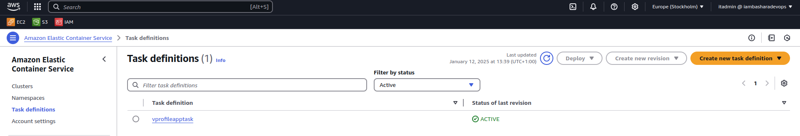
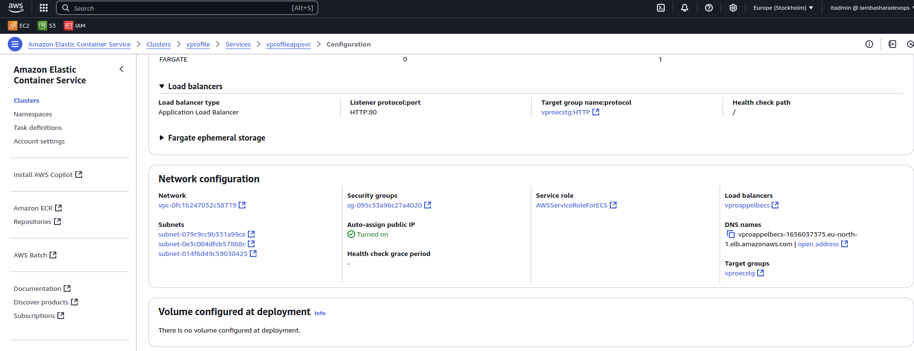

# Project 7: Continous Delivery With Jenkins


[*Project Source*](https://www.udemy.com/course/devopsprojects/?src=sac&kw=devops+projects)


### In project 6 we did our Continous Integration Pipeline now we will do our Continous Delivery part and below is the Architecture


## Step 1 : Before We start our Continous Delivery Journey We will need below services,tools and plugins.
1. AWS:

   - IAM USER With ACCESS Key
   - ECR Registry (Docker registry from AWS)

2. Plugins in Jenkins:

   - docker
   - docker pipeline
   - ECR
   - AWS SDK

3. Tools in Jenkins EC2:
   - Store AWS access keys(credentials)
   - Install Docker Engine in Jenkins
   - Install AWSCLI


### Let's start with installing Tools in Jenkins EC2
 - Let's ssh with Jenkins EC2 from terminal and install AWSCLI
 ```sh
 sudo snap install aws-cli --classic
 ```

 - Install docker engine first Set up Docker's apt repository
 ```sh
# Add Docker's official GPG key:
sudo apt-get update
sudo apt-get install ca-certificates curl
sudo install -m 0755 -d /etc/apt/keyrings
sudo curl -fsSL https://download.docker.com/linux/ubuntu/gpg -o /etc/apt/keyrings/docker.asc
sudo chmod a+r /etc/apt/keyrings/docker.asc

# Add the repository to Apt sources:
echo \
  "deb [arch=$(dpkg --print-architecture) signed-by=/etc/apt/keyrings/docker.asc] https://download.docker.com/linux/ubuntu \
  $(. /etc/os-release && echo "$VERSION_CODENAME") stable" | \
  sudo tee /etc/apt/sources.list.d/docker.list > /dev/null
sudo apt-get update

 ```
 - Install the Docker packages
 ```sh
 sudo apt-get install docker-ce docker-ce-cli containerd.io docker-buildx-plugin docker-compose-plugin
 ```
 - add jenkins user in docker  group

 ```sh
usermod -a -G docker jenkins
 ```


 ### Let's Create services in AWS

 - lets create a user using AWS IAM and attach policies below in the image and create access key for the user.


- lets create ECR where we will store our docker images.


 ### Let's Install following Plugins in Jenkins

- docker
- docker pipeline
- ECR
- AWS SDK
- add the iam user credentials in jenkins


## Step 2: Now lets create new Item and give name Vprofile-ci-pipeline-docker and item type pipeline and use below code

```sh
pipeline {
	agent any
	tools {
	    maven "MAVEN3.9"
	    jdk "JDK17"
	}
	
	environment {
        registryCredential = 'ecr:eu-north-1:awscreds'
        appRegistry = "761018886396.dkr.ecr.eu-north-1.amazonaws.com/vprofileappimg"
        vprofileRegistry = "https://761018886396.dkr.ecr.eu-north-1.amazonaws.com"
    }

	stages {
	   
	    stage('Fetch code') {
            steps {
               git branch: 'docker', url: 'https://github.com/hkhcoder/vprofile-project.git'
            }

	    }


	    stage('Build'){
	        steps{
	           sh 'mvn install -DskipTests'
	        }

	        post {
	           success {
	              echo 'Now Archiving it...'
	              archiveArtifacts artifacts: '**/target/*.war'
	           }
	        }
	    }

	    stage('UNIT TEST') {
            steps{
                sh 'mvn test'
            }
        }

        stage('Checkstyle Analysis') {
            steps{
                sh 'mvn checkstyle:checkstyle'
            }
        }

        stage("Sonar Code Analysis") {
        	environment {
                scannerHome = tool 'sonar6.2'
            }
            steps {
              withSonarQubeEnv('SonarServer') {
                sh '''${scannerHome}/bin/sonar-scanner -Dsonar.projectKey=vprofile \
                   -Dsonar.projectName=vprofile \
                   -Dsonar.projectVersion=1.0 \
                   -Dsonar.sources=src/ \
                   -Dsonar.java.binaries=target/test-classes/com/visualpathit/account/controllerTest/ \
                   -Dsonar.junit.reportsPath=target/surefire-reports/ \
                   -Dsonar.jacoco.reportsPath=target/jacoco.exec \
                   -Dsonar.java.checkstyle.reportPaths=target/checkstyle-result.xml'''
              }
            }
            
            
        }
        
        stage("Quality Gate") {
            steps {
              timeout(time: 1, unit: 'HOURS') {
                waitForQualityGate abortPipeline: true
              }
            }
          }
        
       stage('Build App Image') {
          steps {
       
            script {
                dockerImage = docker.build( appRegistry + ":$BUILD_NUMBER", "./Docker-files/app/multistage/")
                }
          }
    
        }

        stage('Upload App Image') {
          steps{
            script {
              docker.withRegistry( vprofileRegistry, registryCredential ) {
                dockerImage.push("$BUILD_NUMBER")
                dockerImage.push('latest')
              }
            }
          }
        }

  }
}
```
- here is the pipeline after sucessfull build 


- here is the docker image in ECR


## Step 3: Now we will setup ECS on AWS and run our container

- we created ECS cluster name vprofile using AWS Fargate and we turn on monitoring and created a tag


- we gave task defination as below 



- we create a service under task


- we can find the dns URl under configuration and networking and we can check our vprofile app from browser



- vprofile app from browser


## Step 4: Till Now we did our deployment manually now will setup everything from jenkins and  deployment will be automatic.
 
 - we will create new Item name Vprofile-CI-CD-pipeline in Jenkins and use below code for pipeline

 ```sh
 pipeline {
	agent any
	tools {
	    maven "MAVEN3.9"
	    jdk "JDK17"
	}
	
	environment {
        registryCredential = 'ecr:eu-north-1:awscreds'
        appRegistry = "761018886396.dkr.ecr.eu-north-1.amazonaws.com/vprofileappimg"
        vprofileRegistry = "https://761018886396.dkr.ecr.eu-north-1.amazonaws.com"
        cluster = "vprofile"
        service = "vprofileappsvc"
    }

	stages {
	   
	    stage('Fetch code') {
            steps {
               git branch: 'docker', url: 'https://github.com/hkhcoder/vprofile-project.git'
            }

	    }


	    stage('Build'){
	        steps{
	           sh 'mvn install -DskipTests'
	        }

	        post {
	           success {
	              echo 'Now Archiving it...'
	              archiveArtifacts artifacts: '**/target/*.war'
	           }
	        }
	    }

	    stage('UNIT TEST') {
            steps{
                sh 'mvn test'
            }
        }

        stage('Checkstyle Analysis') {
            steps{
                sh 'mvn checkstyle:checkstyle'
            }
        }

        stage("Sonar Code Analysis") {
        	environment {
                scannerHome = tool 'sonar6.2'
            }
            steps {
              withSonarQubeEnv('SonarServer') {
                sh '''${scannerHome}/bin/sonar-scanner -Dsonar.projectKey=vprofile \
                   -Dsonar.projectName=vprofile \
                   -Dsonar.projectVersion=1.0 \
                   -Dsonar.sources=src/ \
                   -Dsonar.java.binaries=target/test-classes/com/visualpathit/account/controllerTest/ \
                   -Dsonar.junit.reportsPath=target/surefire-reports/ \
                   -Dsonar.jacoco.reportsPath=target/jacoco.exec \
                   -Dsonar.java.checkstyle.reportPaths=target/checkstyle-result.xml'''
              }
            }
            
            
        }
        
        stage("Quality Gate") {
            steps {
              timeout(time: 1, unit: 'HOURS') {
                waitForQualityGate abortPipeline: true
              }
            }
          }
        
       stage('Build App Image') {
          steps {
       
            script {
                dockerImage = docker.build( appRegistry + ":$BUILD_NUMBER", "./Docker-files/app/multistage/")
                }
          }
    
        }

        stage('Upload App Image') {
          steps{
            script {
              docker.withRegistry( vprofileRegistry, registryCredential ) {
                dockerImage.push("$BUILD_NUMBER")
                dockerImage.push('latest')
              }
            }
          }
        }

        stage('Deploy to ecs') {
          steps {
            withAWS(credentials: 'awscreds', region: 'eu-north-1') {
            sh 'aws ecs update-service --cluster ${cluster} --service ${service} --force-new-deployment'
               }
          }
        }

  }
}
 ```

 - After finishing build process our pipeline will look below which is implementation of complete CI-CD Process using jenkins and it's completely automatic.

 


## Step 5: Cleanup
- we will clean all the services we used in this project in order to avoid any charges.

