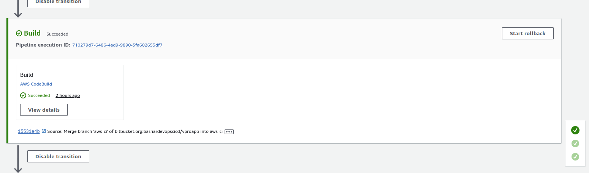

# Project 8: Continous Integration and Continous Delivery in AWS

## Pre-Requisites:
* AWS Account
* AWS Elastic Beanstalk
* AWS RDS
* Bitbucket repository
* AWS Code Build
* AWS Code Pipeline
* S3
* Git installed on Local


[*Project Source*](https://www.udemy.com/course/devopsprojects/?src=sac&kw=devops+projects)


## Step 1 : AWS Elastic Beanstalk
- At first we will create a key-pair 


- Next wil create beanstalk application
```sh
Application Name: Vprofile
Environment name: vprofile-prod11
Domain : vprofile-prod11
Platform : Tomcat
Preset : Custom configuration
service role : Use an existing service role and we will choose exisiting role we created in our previous project
keypair: we will choose the key pair we just created.
EC2 instance profile: vprofile-bean-role we will choose
vpc : choose default
Public Ip : Activated (choose all the subnets)
tags: key- Project  value - vprofile
Root Volume : GP3
Auto Scaling group : Load balanced
Instances : Min 2 Max 4
instance Type : T3 Micro
Processes: we will enabled Session Stickiness
Rolling Updates: Rolling
Deployment batch size: 50

```


## Step 2 : AWS RDS
```sh
Database creation method : Standard create
Engine type : Mysql
Mysql Engine Version : MYSQL 8.0.35
Template : Free tier
DB Instance name: vprords
username: admin
password : auto generate
instance type: t3 micro
create new security group : vprords-sg
intial database name : accounts

create database  and make sure copy database password in a safe place

```


- we will edit our rds security group  and in inbound rule we will allow beanstalk instance in port 3306


- we will SSH to any of the instance created by beanstalk and we will intilize our database
```sh
dnf install mariadb105 -y

mysql -h 'end point of our rds' -u admin -p"password of ours database" accounts

download the database schema : wget https://raw.githubusercontent.com/hkhcoder/vprofile-project/refs/heads/aws-ci/src/main/resources/db_backup.sql

mysql -h 'end point of our rds' -u admin -p"password of ours database" accounts < db_backup.sql

```

## Step 3 : Bitbucket repository
1. Bitbucket.org:

   - create account
   ```sh
   create account using google in bitbucket.org
   ```
   - create repository
    ```sh
   At first we will create a workspace and  we will setup our Repo
   Workspace : bashardevopscicd
   Repo : vproapp
   Repo type : Private
   include a readme : NO
   include gitignore: NO
   ```

2. Keys :

   - Generate SSH keys
   ```sh
   let's change directory to root 
   ~
   cd .ssh/
   ssh-keygen
   vprobit_rsa
   cat vprobit_rsa

   copy th public key and next we will store it in Bitbucket
   
   ```
   - Copy Public key to Bitbucket account
   ```sh
   click on gear Icon and go personal bitbucket setting and then ssh key then add the copied key.
   ```
   - SSh config file for bitbucket
   ```sh
   In the same directory .ssh/ we will create config  file

   vi config 

   Host bitbucket.org
    PreferredAuthentications publickey
    Identityfile ~/.ssh/vprobit_rsa


   ```


3. Migration From Github To Bitbucket Repo:

   - Add Bitbucket repository URL
   ```sh
   ssh -T git@bitbucket.org
   cd /tmp
   git clone git@bitbucket.org:bashardevopscicd/vproapp.git
   
   ```
  - Clone source code from github
    ```sh
    git clone https://github.com/hkhcoder/vprofile-project.git
    git checkout aws-ci
    git fetch --tags
    git remote rm origin
    git remote add origin git@bitbucket.org:bashardevopscicd/vproapp.git
    git push origin --all

    ```

  


## Step 4: AWS Code Build

 - Before Code Build we will create a S3 Bucket 

 ```sh
 make sure same region as RDS and beanstalk
 Bucket type: General purpose
 Bucket name : basharcicdvproartifact

 ```
 - Let's create codebuild
```sh
Project name: Vproappbuild
Source Provider : Bitbucket
Connection: Using OAuth
repo : select bitbucket rep
source version: aws-ci
os: ubuntu
image: 7.0
build commands:

version: 0.2

#env:
  #variables:
     # key: "value"
     # key: "value"
  #parameter-store:
     # key: "value"
     # key: "value"

phases:
  install:
   runtime-versions:
      java: corretto17
  pre_build:
    commands:
      - apt-get update
      - apt-get install -y jq 
      - wget https://archive.apache.org/dist/maven/maven-3/3.9.8/binaries/apache-maven-3.9.8-bin.tar.gz
      - tar xzf apache-maven-3.9.8-bin.tar.gz
      - ln -s apache-maven-3.9.8 maven
      - sed -i 's/jdbc.password=admin123/jdbc.password=K5QhPP2LAUGSmdkqyqyA/' src/main/resources/application.properties
      - sed -i 's/jdbc.username=admin/jdbc.username=admin/' src/main/resources/application.properties
      - sed -i 's/db01:3306/vprords.cxca2eu6az4w.eu-north-1.rds.amazonaws.com:3306/' src/main/resources/application.properties
  build:
    commands:
      - mvn install
  post_build:
    commands:
       - mvn package
artifacts:
  files:
     - '**/*'
  base-directory: 'target/vprofile-v2'


  also in application properties file in bitbucket we will add the same info


  jdbc.password=admin123/jdbc.password=K5QhPP2LAUGSmdkqyqyA/
  jdbc.username=admin/jdbc.username=admin/
  vprords.cxca2eu6az4w.eu-north-1.rds.amazonaws.com:3306


  Artifact: Amazon s3
  Bucketname: basharcicdvproartifact
  Cloudwatchlog
  groupname: vprofileproject
  streamname:vprobuild

```
 

## Step 5: AWS Code Pipeline
```sh
Pipeline name: vprocicdpipeline
source: bitbucket
connection: connect to bitbucket and grant acces
repository name : bashardevopscicd/vproapp
branch: aws-ci
build provider: aws codebuild
project name : vproappbuild
deploy provider: AWS Elastic Beanstalk
Application name: vprofile
Environment name: Vprofile-prod11
```





- we can see the database also working in our app


## Step 6: Test CICD flow with git commit
- we edit readme.md of our project and push the code in our repo


- pipeline triggered and build the app


## Step 8: Cleanup

- we will clean all the services we used in this project in order to avoid any charges from aws

